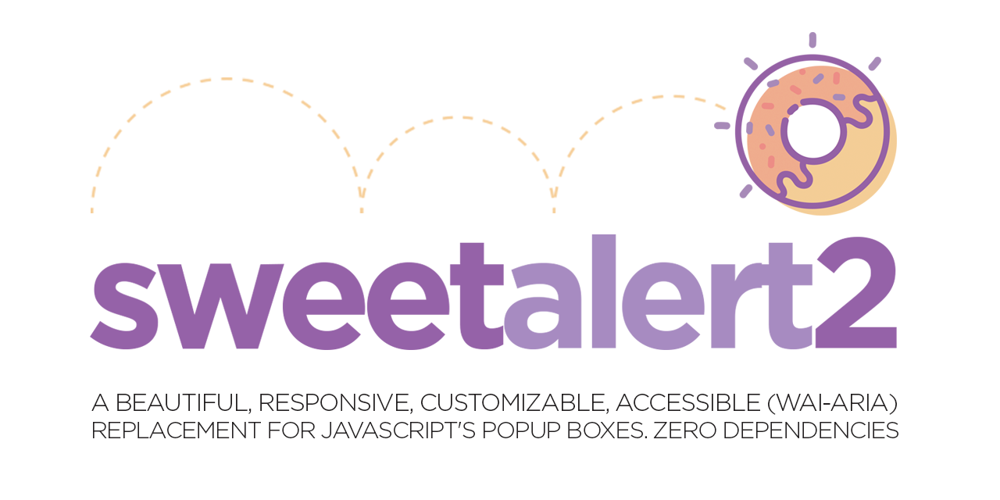
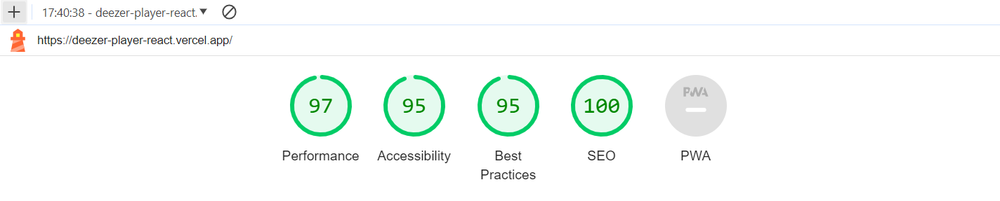

# Deezer API

## NextJS / ReactJS (Redux & SWR)

<br>

<div align="center">
  
</div>

<br>

<div>

    Deezer API is a music player and artist search tool connected to Deezer's external and public API.
    It allows you to browse its database to find your favorite tracks, play them, and create your own
    Library with your data.

</div>

<br>

**DEPLOY**:
<br>
https://deezer-player-react.vercel.app

<br>
<br>

# Index

1. [Project Title and Deployment Link](#deezer-api)

2. [Features](#features)

3. [Components](#components)

4. [Technologies and Tools used](#technologies-and-tools-used)

5. [Lighthouse Results](#lighthouse-results)

6. [Project Setup](#project-setup)

7. [Contribution](#contribution)

8. [Project Status](#project-status)

9. [Project Developer](#project-developer)

<br>

## Features

<div>

    ✔️ APP state managed with Redux and SWR

    ✔️ Search Engine for Tracks and Artists

    ✔️ Music Player with Playback Controls

    ✔️ Library for Adding or Removing Favorite Tracks and/or Artists

    ✔️ Error handling

    ✔️ Responsive design

    ✔️ SCSS with custom variables

    ✔️ Flexbox and grid layouts

    ✔️ User feedbacks

</div>

<br>

## Components

<div>

    ⚛️ SEARCH ENGINE
        - TRACKS: 3 items to choose from, and the selected one will play in the PLAYER
        - ARTISTS: 3 related artists listed, selecting one navigates to their page dynamically

    ⚛️ ARTIST PAGE
        - Displays the artist's top 5 tracks, with the option to play them
        - Artist's image
        - Button to automatically play the first track
        - Favorite button to add the artist to the Artists section of the Library

    ⚛️ PLAYER
        - Track title
        - Artist name
        - Album image
        - Track progress bar
        - Total track duration
        - Volume control with Mute option
        - Playback buttons:
          - Play / Pause
          - Previous track
          - Next track

    ⚛️ TRACK
        - Track title
        - Artist name
        - Type of item
        - Album cover
        - Favorite icon to Add or Remove from Library

    ⚛️ LIBRARY
        Local and persistent database that allows storing:
          - Favorite Tracks
          - Favorite Artists

    ⚛️ FAVORITE BUTTON
        Allows Adding or Removing the track and/or artist from the Library

    ⚛️ TRENDING TRACKS
        A dynamic list that compiles the top 12 global tracks

    ⚛️ SPINNER
        Used for loading elements

    ⚛️ UNDER CONSTRUCTION
        A presentation component for empty pages

    ⚛️ ERROR / NOT FOUND
        A presentation component for errors and non-existent pages

</div>

<br>

## Technologies and Tools used

<div align="center">
  <br>
  <a href="https://nextjs.org/" target="_blank" rel="noreferrer"> </a>
  <a href="https://reactjs.org/" target="_blank" rel="noreferrer"> </a>
  <a href="https://redux.js.org" target="_blank" rel="noreferrer"> </a>
  <a href="https://swr.vercel.app/es-ES" target="_blank" rel="noreferrer"> </a>
  <br>
  <br>
  <a href="https://developer.mozilla.org/en-US/docs/Web/JavaScript" target="_blank" rel="noreferrer"> </a>
  <a href="https://sass-lang.com/" target="_blank" rel="noreferrer"> </a>
  <a href="https://sweetalert2.github.io/" target="_blank" rel="noreferrer"> </a>
  <br>
  <br>
  <br>
  <a href="https://eslint.org/" target="_blank" rel="noreferrer"> </a>
  <a href="https://prettier.io/" target="_blank" rel="noreferrer"> </a>
  <a href="https://developer.chrome.com/docs/lighthouse/overview/" target="_blank" rel="noreferrer"> </a>
  <a href="https://vercel.com/" target="_blank" rel="noreferrer"> </a>
</div>

<br>

## Lighthouse Results

<div align="center">
  
</div>

<br>

## Project Setup

First, run the development server:

```bash
npm run dev
# or
yarn dev
# or
pnpm dev
# or
bun dev
```

Open [http://localhost:3000](http://localhost:3000) with your browser to see the result.

You can start editing the page by modifying `app/page.js`. The page auto-updates as you edit the file.

This project uses [`next/font`](https://nextjs.org/docs/basic-features/font-optimization) to automatically optimize and load Inter, a custom Google Font.

## Learn More

To learn more about Next.js, take a look at the following resources:

- [Next.js Documentation](https://nextjs.org/docs) - learn about Next.js features and API.
- [Learn Next.js](https://nextjs.org/learn) - an interactive Next.js tutorial.

You can check out [the Next.js GitHub repository](https://github.com/vercel/next.js/) - your feedback and contributions are welcome!

## Deploy on Vercel

The easiest way to deploy your Next.js app is to use the [Vercel Platform](https://vercel.com/new?utm_medium=default-template&filter=next.js&utm_source=create-next-app&utm_campaign=create-next-app-readme) from the creators of Next.js.

Check out our [Next.js deployment documentation](https://nextjs.org/docs/deployment) for more details.

<br>

## Contribution

If you want to contribute to this project, follow these steps:

1. Perform a fork to the repository.

2. Create a branch for your feature or bugfix: `git checkout -b feature/your-feature-name`

3. Make the necessary changes and commits:  `git commit -m 'Add some feature'`

4. Push to branch: `git push origin feature/your-feature-name`

5. Send a pull request to the original repository.

<br>

## Project Status

<br>


<br>

## Project Developer

<br>

| [<br><sub>Kevin Schans</sub>](https://github.com/KevinVanDerSchans) |
:------------------------------------------------------------------------------------------------------------------------------------------: |
